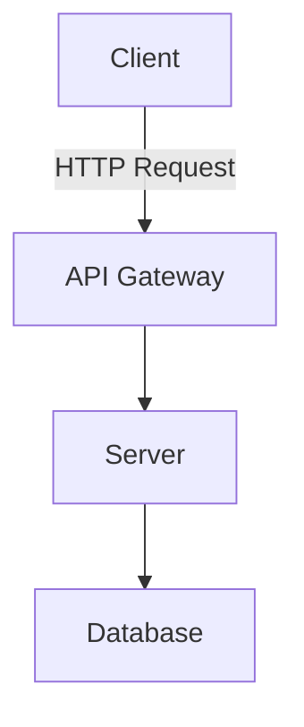

# Documentation

This directory contains comprehensive documentation for the MNM Apparel project.

## Directory Structure

```
docs/
├── api/              # API documentation
├── architecture/     # System architecture and design docs
├── guides/          # User and developer guides
└── README.md        # This file
```

## Documentation Index

### API Documentation

- [API Overview](api/overview.md) - REST API introduction and conventions
- [Authentication](api/authentication.md) - Authentication and authorization
- [Endpoints Reference](api/endpoints.md) - Complete API endpoints documentation

### Architecture Documentation

- [System Architecture](architecture/system-overview.md) - High-level system design
- [Database Schema](architecture/database-schema.md) - Database structure and relationships
- [Tech Stack](architecture/tech-stack.md) - Technologies and frameworks used

### Developer Guides

- [Getting Started](guides/getting-started.md) - Setup and installation guide
- [Development Workflow](guides/development-workflow.md) - Git workflow and best practices
- [Deployment Guide](guides/deployment.md) - Deployment instructions
- [Testing Guide](guides/testing.md) - Testing strategies and guidelines
- [Contributing](guides/contributing.md) - Contribution guidelines

## Writing Documentation

### Guidelines

1. **Be Clear and Concise** - Use simple language and short sentences
2. **Use Examples** - Include code examples and screenshots
3. **Keep Updated** - Update docs when code changes
4. **Follow Structure** - Use consistent formatting and headings
5. **Link Related Docs** - Cross-reference related documentation

### Markdown Standards

- Use ATX-style headers (`#`, `##`, `###`)
- Use fenced code blocks with language identifiers
- Use relative links for internal references
- Include a table of contents for long documents

### Code Examples

```markdown
# Example heading

Description of the feature or concept.

## Code Example

\`\`\`javascript
// Example code with comments
const example = () => {
  console.log('Hello, World!');
};
\`\`\`

## Notes

- Important point 1
- Important point 2
```

## Documentation Tools

### Generating API Docs

The API documentation is auto-generated from code:

```bash
# FastAPI generates docs automatically at /docs and /redoc
cd server
uvicorn main:app --reload

# Visit http://localhost:8000/docs
```

### Static Site Generation

For building a documentation website:

```bash
# Using MkDocs
pip install mkdocs
mkdocs serve

# Visit http://localhost:8001
```

## Diagrams and Visuals

Use [Mermaid](https://mermaid.js.org/) for creating diagrams in Markdown:



## Contributing to Documentation

1. Find the relevant documentation file
2. Make your changes following the guidelines
3. Test links and code examples
4. Submit a pull request
5. Request review from maintainers

## Documentation Maintenance

- Review and update quarterly
- Archive outdated documentation
- Add new sections as features are added
- Gather feedback from users

## Resources

- [Markdown Guide](https://www.markdownguide.org/)
- [Documentation Best Practices](https://www.writethedocs.org/guide/)
- [API Documentation Templates](https://github.com/readthedocs/readthedocs.org)
